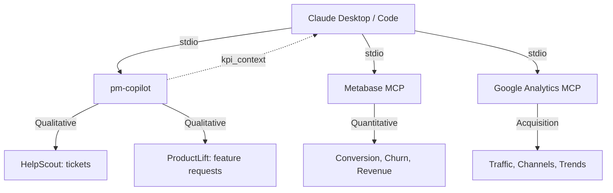

# PM Copilot

An MCP server that triangulates customer support tickets and feature requests to help PMs decide what to build next.

[](#)
[](LICENSE)
[](#)
[](#)

---

> **Real results:** Analyzed 2,370 signals (2,136 support tickets + 234 feature requests) across 3 products in 55 seconds. Identified 16 themes, 15 convergent. Top priority: Booking & Scheduling (score: 134.6) — 629 tickets + 77 feature requests pointing at the same problem.

---

## What Makes This Different

- **Signal triangulation** — Not just data access. Matches support tickets against feature requests to find convergent themes, then scores them with a weighted formula that gives convergent signals a 2x priority boost.
- **Composability** — Designed to work *with* other MCP servers. Pass churn data from Metabase or traffic trends from Google Analytics into `generate_product_plan` via `kpi_context`, and the methodology adjusts priorities accordingly.
- **PM methodology built in** — Opinionated scoring based on 7 years of real product management across 9 products and 1M+ users. Not a generic framework — an actual decision-making process exposed as an MCP resource.
- **PII scrubbing** — Customer data never reaches the LLM unfiltered. SSNs, credit cards (Luhn-validated), emails, and phone numbers are redacted before analysis. Agent responses are filtered out of quotes.

## Architecture



Claude orchestrates multiple MCP servers. PM Copilot handles qualitative customer signals. Other servers provide quantitative business metrics. The `kpi_context` parameter is the integration point — no point-to-point integrations required.

## Quick Start

```bash
git clone https://github.com/dkships/pm-copilot.git
cd pm-copilot
npm install
cp .env.example .env   # Edit with your credentials
npm run build
```

### Claude Desktop

Add to `~/Library/Application Support/Claude/claude_desktop_config.json`:

```json
{
  "mcpServers": {
    "pm-copilot": {
      "command": "node",
      "args": ["/absolute/path/to/pm-copilot/dist/index.js"]
    }
  }
}
```

### Claude Code

```bash
claude mcp add pm-copilot -- node /absolute/path/to/pm-copilot/dist/index.js
```

Or use the `.mcp.json` already in the project root — Claude Code picks it up automatically.

## Tools

### `synthesize_feedback`

Cross-references HelpScout tickets and ProductLift feature requests, returns theme-matched analysis with priority scores.

| Parameter | Type | Default | Description |
|-----------|------|---------|-------------|
| `timeframe_days` | number | 30 | Days to look back (1-90) |
| `top_voted_limit` | number | 50 | Max feature requests by vote count |
| `mailbox_id` | string | — | HelpScout mailbox filter |
| `portal_name` | string | — | ProductLift portal filter |
| `detail_level` | string | `"summary"` | `"summary"` (~19KB), `"standard"` (~68KB), or `"full"` (~563KB) |

Returns themes sorted by priority score, each with reactive/proactive counts, convergence flag, evidence summaries, and representative customer quotes.

### `generate_product_plan`

Builds a prioritized product plan with evidence and customer quotes. Accepts external business metrics via `kpi_context`.

| Parameter | Type | Default | Description |
|-----------|------|---------|-------------|
| `timeframe_days` | number | 30 | Days to look back (1-90) |
| `top_voted_limit` | number | 50 | Max feature requests by vote count |
| `mailbox_id` | string | — | HelpScout mailbox filter |
| `portal_name` | string | — | ProductLift portal filter |
| `kpi_context` | string | — | Business metrics from other MCP servers |
| `max_priorities` | number | 5 | Number of priorities to return (1-10) |
| `preview_only` | boolean | false | Audit mode: show what data *would* be sent |
| `detail_level` | string | `"summary"` | `"summary"` (~7KB), `"standard"` (~21KB), or `"full"` (~584KB) |

### `get_feature_requests`

Raw ProductLift data access for browsing feature requests directly.

| Parameter | Type | Default | Description |
|-----------|------|---------|-------------|
| `portal_name` | string | — | Filter to a specific portal |
| `include_comments` | boolean | true | Include comments on each request |

## Composability

PM Copilot is designed to work alongside other MCP servers. The `kpi_context` parameter on `generate_product_plan` is the integration point.

When Claude has multiple MCP servers connected — say Metabase for database queries and Google Analytics for traffic data — a PM can make a single request:

> "Pull our churn data from Metabase, our traffic trends from GA, and then use pm-copilot to create a product plan using all of that context."

Claude calls the other servers first, then passes their output as `kpi_context`:

```
generate_product_plan({
  timeframe_days: 30,
  kpi_context: "TidyCal churn: 3.2% → 4.1% MoM. Booking completion: 78% → 70%.
                Organic traffic: +22% MoM. Top landing pages: /pricing, /features."
})
```

The methodology resource tells Claude how to weight business metrics against customer signals: rising churn elevates reactive themes, strong growth elevates proactive ones.

## Methodology

PM Copilot exposes a `pm-copilot://methodology` resource — David Kelly's actual product planning framework built over 7 years of launching 9 products to 1M+ users at AppSumo Originals.

Key principles:
- **The 5% rule** — You complete ~5% of what customers ask for each month. The framework identifies which 5% matters most.
- **Convergent signals always win** — Same theme in both support tickets AND feature requests = highest confidence signal.
- **Reactive > proactive** — Broken stuff drives churn. You can survive not having a feature; you can't survive errors.
- **Business metrics override the formula** — Rising churn, dropping conversion, or revenue impact can change everything.

The methodology is versioned (v2.0) and served as markdown content via the MCP resource protocol. Claude references it automatically when using `generate_product_plan`.

## Security

Customer data flows through PM Copilot on its way to Claude. All text is scrubbed before it enters the analysis pipeline or leaves the server.

### PII scrubbing

| Category | Method | Replacement |
|----------|--------|-------------|
| SSNs | Pattern match (`XXX-XX-XXXX`) | `[SSN REDACTED]` |
| Credit cards | 13-19 digit sequences + Luhn validation | `[CREDIT CARD REDACTED]` |
| Email addresses | Standard email pattern | `[EMAIL REDACTED]` |
| Phone numbers | US formats (+1, parens, dashes, dots) | `[PHONE REDACTED]` |
| Customer email field | Always redacted | `[REDACTED]` |

### What we exclude entirely

| Data | Why |
|------|-----|
| Agent/admin responses | Only customer voice matters; agent replies could leak internal process |
| Internal HelpScout notes | May contain credentials, workarounds, internal discussions |
| Attachments | Could contain screenshots with PII, invoices, medical documents |
| Voter identities | Vote counts are sufficient; individual identity adds no PM value |

### Audit controls

- `preview_only: true` on `generate_product_plan` shows what data *would* be sent without fetching it
- Every response includes `pii_scrubbing_applied` and `pii_categories_redacted` metadata
- Data categories logged to stderr on each call (categories only, never content)

## Development

```bash
npm install          # Install dependencies
npm run build        # Compile TypeScript
npm run dev          # Watch mode
npm start            # Run the server
```

### Theme configuration

`themes.config.json` in the project root defines what themes to look for. Edit without rebuilding — loaded at runtime.

Ships with 16 data-driven themes across 9 categories. Add your own by appending to the `themes` array. Unmatched data points are analyzed for emerging patterns using bigram/trigram frequency detection.

### Scoring formula

```
priority = (frequency × 0.35 + severity × 0.35 + vote_momentum × 0.30) × convergence_boost
```

- **Frequency** (0.35): Count of data points, normalized across themes
- **Severity** (0.35): Reactive signals only — thread depth, recency (7-day half-life decay), tag boosts
- **Vote momentum** (0.30): Proactive signals only — 80% votes + 20% comments
- **Convergence** (2x): Applied when a theme has both reactive and proactive signals

## Contributing

1. Fork the repository
2. Create a feature branch (`git checkout -b feature/your-feature`)
3. Ensure `npm run build` succeeds with no errors
4. Follow existing patterns: tools use `registerTool`, API clients get their own module, PII scrubbing happens at the format layer
5. Open a pull request

## License

[MIT](LICENSE)
