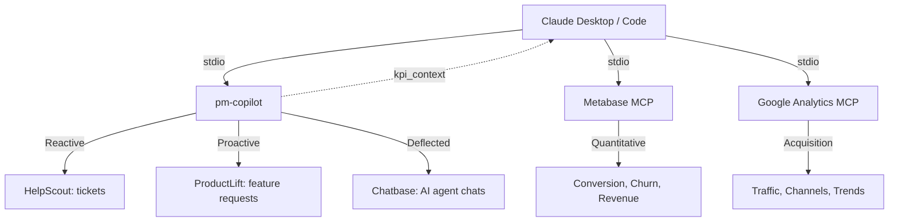

# PM Copilot

An MCP server that triangulates customer support tickets, feature requests, and AI support agent conversations to help PMs decide what to build next.

[](#)
[](LICENSE)
[](#)
[](#)

---

> **Real results:** Analyzed 3,353 signals in one 30-day window: 1,678 support tickets, 276 feature requests, and 1,399 AI support agent conversations across 4 products.
>
> The chats are signal a ticket-only analysis never sees.

**Read the full story:** [I built an MCP server that changed how I prioritize products](https://dmkthinks.org/blog/i-built-an-mcp-server-that-changed-how-i-prioritize-products/)

---

## What makes this different

- **Signal triangulation.** Matches support tickets against feature requests to find convergent themes, and gives convergent themes a 2x priority boost.
- **The deflection blind spot.** An AI support agent answers questions that never become tickets, so ticket-based prioritization undercounts every theme the bot handles. Chatbase conversations come in as a third signal class, with a per-theme `self_serve_failure_rate`.
- **Composability.** Pass churn or traffic data from other MCP servers into `generate_product_plan` via `kpi_context`, and the methodology adjusts priorities.

## Architecture


```mermaid
graph TD
    A[Claude Desktop / Code] -->|stdio| B[pm-copilot]
    A -->|stdio| C[Metabase MCP]
    A -->|stdio| D[Google Analytics MCP]
    B -->|Reactive| E[HelpScout: tickets]
    B -->|Proactive| F[ProductLift: feature requests]
    B -->|Deflected| I[Chatbase: AI agent chats]
    C -->|Quantitative| G[Conversion, Churn, Revenue]
    D -->|Acquisition| H[Traffic, Channels, Trends]
    B -.->|kpi_context| A
```

## Quick start

Requires Node 20+. Not published to npm, so install from source:

```bash
git clone https://github.com/dkships/pm-copilot.git
cd pm-copilot
npm install
cp .env.example .env   # Edit with your credentials
npm run build
```

`.env` lives in the repo root. The server loads it from there regardless of the working directory it's launched from.

### Credentials

HelpScout is required. ProductLift and Chatbase are optional, and the analysis adapts to whichever you configure.

| Variable | Required | Description |
|----------|----------|-------------|
| `HELPSCOUT_APP_ID` | Yes | OAuth app ID from https://secure.helpscout.net/apps/custom/ |
| `HELPSCOUT_APP_SECRET` | Yes | OAuth app secret |
| `PRODUCTLIFT_PORTALS` | No | Multi-portal: `name\|url\|key,name2\|url2\|key2` |
| `PRODUCTLIFT_PORTAL_URL` | No | Single portal URL |
| `PRODUCTLIFT_API_KEY` | No | Single portal Bearer token |
| `PRODUCTLIFT_PORTAL_NAME` | No | Portal display name (default: `default`) |
| `CHATBASE_API_KEY` | No | Account-wide secret key from Chatbase → Settings → API keys |
| `CHATBASE_AGENTS` | No | Multi-agent: `name\|agentId,name2\|agentId2` |
| `CHATBASE_AGENT_ID` | No | Single agent id |
| `CHATBASE_AGENT_NAME` | No | Single agent display name (default: `default`) |

Chatbase API access needs a Standard plan or higher; on a lower plan the deflection signal becomes a warning. One agent per product gives product-level attribution a shared mailbox doesn't.

### Claude Desktop

Add to `~/Library/Application Support/Claude/claude_desktop_config.json`:

```json
{
  "mcpServers": {
    "pm-copilot": {
      "command": "node",
      "args": ["/absolute/path/to/pm-copilot/dist/index.js"]
    }
  }
}
```

### Claude Code

```bash
claude mcp add pm-copilot -- node /absolute/path/to/pm-copilot/dist/index.js
```

Or open Claude Code in the repo: it prompts you to approve the project `.mcp.json`.

### Verify

Restart the client and ask it to run `list_sources`. It should list your HelpScout mailboxes and any portals or agents you configured.

## Tools

### Common filters

Shared by `synthesize_feedback` and `generate_product_plan`.

| Parameter | Type | Default | Description |
|-----------|------|---------|-------------|
| `timeframe_days` | number | 30 | Days to look back (1-90) |
| `top_voted_limit` | number | 50 | Top-voted requests per portal (1-200). Recent requests in the timeframe are always included on top |
| `mailbox_id` | string | — | HelpScout mailbox ID |
| `mailbox_name` | string | — | HelpScout mailbox name (case-insensitive), resolved to an ID |
| `portal_name` | string | — | ProductLift portal |
| `agent_name` | string | — | Chatbase agent |
| `source_filter` | string | — | Chatbase conversation source, comma-separated for multiple (e.g. `Widget or Iframe` or `WhatsApp,API`). Case-insensitive |
| `include_comments` | boolean | false | Also fetch ProductLift comment text (scrubbed, names dropped) for theme matching and quotes. One extra call per request with comments |
| `detail_level` | string | `"summary"` | `"summary"`, `"standard"`, or `"full"`. Output grows with each step |

Run `list_sources` to see valid mailbox, portal, agent and source names.

### `synthesize_feedback`

Returns themes sorted by priority score, each with per-class counts, a convergence flag, an evidence summary and representative quotes. Roughly 15KB at `summary`, several hundred KB at `full`. Common filters only.

### `generate_product_plan`

Builds a prioritized plan with evidence and customer quotes. Takes the common filters plus:

| Parameter | Type | Default | Description |
|-----------|------|---------|-------------|
| `kpi_context` | string | — | Business metrics from other MCP servers, passed through verbatim |
| `max_priorities` | number | 5 | Number of priorities to return (1-10) |
| `preview_only` | boolean | false | Audit mode: show what data *would* be sent, without fetching it |
| `format` | string | `"json"` | `"json"` (structured) or `"markdown"` (ready-to-read brief) |

### `get_feature_requests`

Raw ProductLift access. Each request includes its public `url`.

| Parameter | Type | Default | Description |
|-----------|------|---------|-------------|
| `portal_name` | string | — | Filter to one portal |
| `include_comments` | boolean | true | Include comments on each request |
| `status` | string | — | Filter by status (case-insensitive), e.g. `open`, `planned`, `completed` |
| `limit` | number | — | Requests to return per portal (1-500), after the status filter and sort. Comments are fetched only for what's kept |
| `sort` | string | — | `"votes"` or `"recent"`. Omit to keep the portal's order |

### `list_sources`

Lists configured mailboxes, portals and agents, plus `chatbase_conversation_sources` (the values `source_filter` accepts) when Chatbase is set up. Never returns keys or customer data. No parameters.

## Signal classes

| Class | Source | What it means | Feeds |
|-------|--------|---------------|-------|
| Reactive | HelpScout tickets | Something is broken | Frequency, severity, convergence |
| Proactive | ProductLift requests | Something is wanted | Frequency, vote momentum, convergence |
| Deflected | Chatbase conversations | Something was asked, and self-serve either handled it or didn't | Frequency only |

Deflected signals never affect severity, vote momentum or the convergence boost. Each theme carries:

- `deflected_count`: conversations matching the theme
- `self_serve_failure_rate`: share of those where the agent's lowest answer confidence fell below 0.5
- `mean_answer_confidence`: mean of that same score

Chatbase doesn't document what its `min_score` measures, so these are evidence for the LLM to weigh, not part of the score. The analysis also counts conversations per channel (`chatbase_sources`). An unrecognized `source_filter` value is passed through with a warning, not rejected. Without Chatbase, the deflection fields are absent.

## Example output

A trimmed `synthesize_feedback` response at `summary` detail. Values are illustrative. Note the scrubbed email in the first quote.

```json
{
  "timeframe_days": 30,
  "detail_level": "summary",
  "pii_scrubbing_applied": true,
  "pii_categories_redacted": ["email", "phone", "credit_card"],
  "analysis": {
    "total_data_points": 924,
    "reactive_count": 548,
    "proactive_count": 64,
    "deflected_count": 312,
    "themes": [
      {
        "theme_id": "booking-scheduling",
        "label": "Booking & Scheduling",
        "priority_score": 78.4,
        "convergent": true,
        "reactive_count": 211,
        "proactive_count": 19,
        "deflected_count": 96,
        "self_serve_failure_rate": 0.41,
        "representative_quotes": [
          "[Support ticket] \"Double-booked slots again after the timezone change — reach me at [EMAIL REDACTED]\"",
          "[Feature request, 47 votes] \"Let me block buffer time between meetings\"",
          "[AI chat, answer confidence 0.31] \"how do i stop people booking on weekends\""
        ]
      }
    ],
    "emerging_themes": [{ "pattern": "csv export", "frequency": 12 }],
    "unmatched_count": 38
  }
}
```

## Composability

Ask Claude to pull churn and conversion data from your other MCP servers and pass it as `kpi_context`:

```text
Product A: booking completion rate dropped from 74% to 66% over last
30 days. Monthly churn increased from 3.1% to 4.2%. Organic traffic
up 22% MoM. Product B: document completion rate steady at 81%.
Churn flat at 2.8%.
```

The methodology says churn overrides the formula, so a theme tied to Product A's falling completion rate can jump to #1 even when another theme scores higher. The server ranks the signal; the KPI context supplies the judgment.

## Methodology

The `pm-copilot://methodology` resource is my product planning framework from 7 years of launching 9 products to 1M+ users. The core rules:

- **The 5% rule.** You complete about 5% of what customers ask for each month. The framework picks which 5%.
- **Convergent signals win.** A theme in both tickets and feature requests is the highest-confidence signal.
- **Reactive > proactive.** Broken stuff drives churn. You can survive a missing feature; you can't survive errors.
- **Business metrics override the formula.** Rising churn or dropping conversion changes everything.

It's versioned (v2.2). Every `generate_product_plan` response links to it, and tells Claude to apply it when `kpi_context` is set. Whether it gets read depends on the client surfacing resources.

## Evaluation

Themes are matched with keyword lists, not embeddings or an LLM classifier. Customer text never leaves the server, and the same input always produces the same themes, so a ranking can be audited. The cost is recall.

`npm run eval` measures it. On the committed 86-example fixture, config v3 scores micro precision 96.1%, recall 99.0%, F1 97.5%, with a 1.3% miss rate. That number is in-sample (the config was tuned against it), so it's a regression gate. On held-out real chat data, a third of conversations still match no theme.

Full results, what the first run found, and known limits: [docs/evaluation.md](docs/evaluation.md).

## Security

All customer text is scrubbed before it enters the analysis or leaves the server:

- SSNs, credit cards (Luhn-validated), email addresses, and phone numbers (US formats and `+`-prefixed international) are redacted, and scrubbed from feature-request URLs as well. The customer email field is always `[REDACTED]`.
- Agent/admin replies, internal notes, attachments, voter identities, commenter names, and Chatbase assistant turns, lead forms, user IDs and country are excluded entirely.
- `preview_only: true` on `generate_product_plan` shows what would be sent without fetching data.
- Every response includes `pii_scrubbing_applied` and `pii_categories_redacted`.

Details, known limitations and the reporting process: [SECURITY.md](SECURITY.md).

## Theme configuration

`themes.config.json` in the repo root defines the themes. It's read at runtime, so edits don't need a rebuild. It ships with 18 themes across 12 categories; add your own to the `themes` array. Unmatched data points are mined for emerging patterns with bigram/trigram frequency.

Single-word keywords match on a word boundary with an optional regular plural. Multi-word keywords also match on word boundaries. After editing, run `npm run eval` to catch keywords that fire on the wrong theme.

## Scoring formula

```
priority = (frequency × 0.35 + severity × 0.35 + vote_momentum × 0.30) × convergence_boost
```

- **Frequency** (0.35): data point count, normalized across themes. Includes deflected signals.
- **Severity** (0.35): reactive signals only. Thread count, recency (7-day half-life decay), and a boost from the highest-severity matching tag.
- **Vote momentum** (0.30): proactive signals only. 80% votes, 20% comments.
- **Convergence** (2x): applied when a theme has both reactive and proactive signals. Deflected signals don't trigger it.

Frequency and vote momentum are normalized against the top theme in the same call, so scores are relative to one analysis window. Compare rankings across calls, not raw scores.

## Troubleshooting

- **`Missing HELPSCOUT_APP_ID or HELPSCOUT_APP_SECRET`.** Check that `.env` exists in the repo root and has both values.
- **Changes aren't taking effect.** The client runs the compiled `dist/`. Run `npm run build` and restart the client.
- **`No HelpScout mailbox named "…"`.** Run `list_sources` for exact names, or pass `mailbox_id`.
- **`No portal found with name "…"` / `No ProductLift portal named "…"`.** The portal must be in `PRODUCTLIFT_PORTALS` (or the single-portal vars). Run `list_sources`.
- **Chatbase warning: `API access needs a Chatbase Standard plan or higher`.** The rest of the analysis still runs; only the deflection fields are missing.
- **`chatbase_agents` is empty in `list_sources`.** Set both `CHATBASE_API_KEY` and one of `CHATBASE_AGENTS` / `CHATBASE_AGENT_ID`. A key alone configures nothing.

## Contributing

See [CONTRIBUTING.md](CONTRIBUTING.md).

## License

[MIT](LICENSE)
