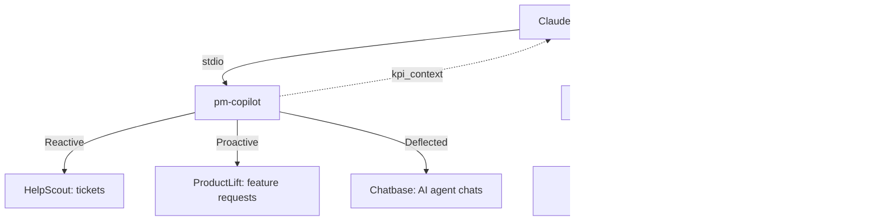

# PM Copilot

An MCP server that triangulates customer support tickets, feature requests, and AI support agent conversations to help PMs decide what to build next.

[](#)
[](LICENSE)
[](#)
[](#)

---

> **Real results:** Analyzed 3,353 signals in one 30-day window — 1,678 support tickets, 276 feature requests, and 1,399 AI support agent conversations across 4 products. Top priority: Booking & Scheduling — 285 tickets + 74 feature requests + 347 chats pointing at the same problem, with the AI agent answering with low confidence in 48% of those chats.
>
> The 1,399 chats are the point. None of them were visible to the analysis before v1.4.0, and they are 83% the volume of the ticket channel.

**Read the full story:** [I built an MCP server that changed how I prioritize products](https://dmkthinks.org/blog/i-built-an-mcp-server-that-changed-how-i-prioritize-products/) — why I built this, how convergent signals work in practice, and what I learned building with Claude Code.

---

## What Makes This Different

- **Signal triangulation.** Matches support tickets against feature requests to find convergent themes, then scores them with a weighted formula that gives convergent signals a 2x priority boost.
- **The deflection blind spot.** An AI support agent answers questions that never become tickets, so ticket-based prioritization undercounts every theme the bot handles — and the gap widens as the bot improves. Chatbase conversations are pulled in as a third signal class, with a per-theme `self_serve_failure_rate` showing where self-serve is failing.
- **Composability.** Works alongside other MCP servers. Pass churn data from Metabase or traffic trends from Google Analytics into `generate_product_plan` via `kpi_context`, and the methodology adjusts priorities accordingly.
- **Built-in PM methodology.** Opinionated scoring based on 7 years of product management across 9 products and 1M+ users. It's a real decision-making process exposed as an MCP resource, not a generic framework.
- **PII scrubbing.** Customer data never reaches the LLM unfiltered. SSNs, credit cards (Luhn-validated), emails, and phone numbers are redacted before analysis. Agent responses are filtered out of quotes.

## Architecture


```mermaid
graph TD
    A[Claude Desktop / Code] -->|stdio| B[pm-copilot]
    A -->|stdio| C[Metabase MCP]
    A -->|stdio| D[Google Analytics MCP]
    B -->|Reactive| E[HelpScout: tickets]
    B -->|Proactive| F[ProductLift: feature requests]
    B -->|Deflected| I[Chatbase: AI agent chats]
    C -->|Quantitative| G[Conversion, Churn, Revenue]
    D -->|Acquisition| H[Traffic, Channels, Trends]
    B -.->|kpi_context| A
```

Claude orchestrates multiple MCP servers. PM Copilot handles qualitative customer signals. Other servers provide quantitative business metrics. The `kpi_context` parameter is the integration point — no point-to-point integrations required.

## Quick Start

```bash
git clone https://github.com/dkships/pm-copilot.git
cd pm-copilot
npm install
cp .env.example .env   # Edit with your credentials
npm run build
```

### Credentials

HelpScout is required. ProductLift and Chatbase are both optional — configure either, both, or
neither, and the analysis adapts.

| Variable | Required | Description |
|----------|----------|-------------|
| `HELPSCOUT_APP_ID` | Yes | OAuth app ID from https://secure.helpscout.net/apps/custom/ |
| `HELPSCOUT_APP_SECRET` | Yes | OAuth app secret |
| `PRODUCTLIFT_PORTALS` | No | Multi-portal: `name\|url\|key,name2\|url2\|key2` |
| `PRODUCTLIFT_PORTAL_URL` | No | Single portal URL |
| `PRODUCTLIFT_API_KEY` | No | Single portal Bearer token |
| `PRODUCTLIFT_PORTAL_NAME` | No | Portal display name (default: `default`) |
| `CHATBASE_API_KEY` | No | Account-wide secret key from Chatbase → Settings → API keys |
| `CHATBASE_AGENTS` | No | Multi-agent: `name\|agentId,name2\|agentId2` |
| `CHATBASE_AGENT_ID` | No | Single agent id |
| `CHATBASE_AGENT_NAME` | No | Single agent display name (default: `default`) |

Chatbase API access needs a Chatbase Standard plan or higher. On a lower plan the API returns
403 and the deflection signal is reported as a warning rather than failing the whole analysis.
One agent per product is the useful shape — agents give you product-level attribution that a
shared support mailbox does not.

### Claude Desktop

Add to `~/Library/Application Support/Claude/claude_desktop_config.json`:

```json
{
  "mcpServers": {
    "pm-copilot": {
      "command": "node",
      "args": ["/absolute/path/to/pm-copilot/dist/index.js"]
    }
  }
}
```

### Claude Code

```bash
claude mcp add pm-copilot -- node /absolute/path/to/pm-copilot/dist/index.js
```

Or use the `.mcp.json` already in the project root — Claude Code picks it up automatically.

## Tools

### `synthesize_feedback`

Cross-references HelpScout tickets, ProductLift feature requests, and Chatbase conversations, returns theme-matched analysis with priority scores.

| Parameter | Type | Default | Description |
|-----------|------|---------|-------------|
| `timeframe_days` | number | 30 | Days to look back (1-90) |
| `top_voted_limit` | number | 50 | Top-voted requests per portal; recent requests in the timeframe are always included on top |
| `mailbox_id` | string | — | HelpScout mailbox filter (raw ID) |
| `mailbox_name` | string | — | HelpScout mailbox name (case-insensitive); auto-resolved to an ID. Run `list_sources` to see names |
| `portal_name` | string | — | ProductLift portal filter |
| `agent_name` | string | — | Chatbase agent filter. Run `list_sources` to see names |
| `source_filter` | string | — | Chatbase conversation source filter, comma-separated for multiple, e.g. `Widget or Iframe` or `WhatsApp,API`. Case-insensitive. Run `list_sources` for the valid values |
| `detail_level` | string | `"summary"` | `"summary"`, `"standard"`, or `"full"`. Output size scales with data volume — roughly 20KB / 100KB / 600KB |

Returns themes sorted by priority score, each with reactive/proactive counts, convergence flag, evidence summaries, and representative customer quotes.

### `generate_product_plan`

Builds a prioritized product plan with evidence and customer quotes. Accepts external business metrics via `kpi_context`.

| Parameter | Type | Default | Description |
|-----------|------|---------|-------------|
| `timeframe_days` | number | 30 | Days to look back (1-90) |
| `top_voted_limit` | number | 50 | Top-voted requests per portal; recent requests in the timeframe are always included on top |
| `mailbox_id` | string | — | HelpScout mailbox filter (raw ID) |
| `mailbox_name` | string | — | HelpScout mailbox name (case-insensitive); auto-resolved to an ID. Run `list_sources` to see names |
| `portal_name` | string | — | ProductLift portal filter |
| `agent_name` | string | — | Chatbase agent filter. Run `list_sources` to see names |
| `source_filter` | string | — | Chatbase conversation source filter, comma-separated for multiple, e.g. `Widget or Iframe` or `WhatsApp,API`. Case-insensitive. Run `list_sources` for the valid values |
| `kpi_context` | string | — | Business metrics from other MCP servers |
| `max_priorities` | number | 5 | Number of priorities to return (1-10) |
| `preview_only` | boolean | false | Audit mode: show what data *would* be sent |
| `detail_level` | string | `"summary"` | `"summary"`, `"standard"`, or `"full"`. Output size scales with data volume — for one 30-day mailbox, roughly 5KB / 21KB / 375KB |
| `format` | string | `"json"` | `"json"` (structured, composable) or `"markdown"` (ready-to-read product brief) |

### `get_feature_requests`

Raw ProductLift data access for browsing feature requests directly. Each request includes its
public `url`.

| Parameter | Type | Default | Description |
|-----------|------|---------|-------------|
| `portal_name` | string | — | Filter to a specific portal |
| `include_comments` | boolean | true | Include comments on each request |
| `status` | string | — | Filter to requests with this status (case-insensitive), e.g. `open`, `planned`, `completed` |

### `list_sources`

Lists the data sources the server is connected to — HelpScout mailboxes (id + name),
ProductLift portals (name + url), and Chatbase agents (name + id) — so you can discover the
names to pass to `mailbox_name` / `portal_name` / `agent_name`. When Chatbase is configured it
also returns `chatbase_conversation_sources`, the values `source_filter` accepts (a fixed list
from the Chatbase docs, not queried per account). Read-only; never returns API keys or customer
data. Takes no parameters.

## Signal classes

Three sources, three different things they tell you. Only the first two feed the convergence rule.

| Class | Source | What it means | Feeds |
|-------|--------|---------------|-------|
| Reactive | HelpScout tickets | Something is broken | Frequency, severity, convergence |
| Proactive | ProductLift requests | Something is wanted | Frequency, vote momentum, convergence |
| Deflected | Chatbase conversations | Something was asked, and self-serve either handled it or did not | Frequency only |

Deflected signals count toward frequency and carry two evidence fields per theme, but they do
not enter the severity or vote-momentum terms and do not change the 2x convergence boost. The
formula is unchanged from v2.1:

- `deflected_count` — conversations matching the theme
- `self_serve_failure_rate` — share of those conversations where the agent's lowest answer confidence fell below 0.5
- `mean_answer_confidence` — mean of that same score

A theme with high `deflected_count` and a high `self_serve_failure_rate` is one customers keep
asking about that self-serve does not resolve. Chatbase does not document what its `min_score`
field measures, so it is reported as evidence for the LLM to weigh rather than folded into the
priority score.

Conversations arrive from several channels (widget, WhatsApp, Messenger, API, …). The analysis
reports a `chatbase_sources` count per channel, and the `source_filter` parameter narrows a run
to one or more channels (comma-separated) — the filter is applied server-side by Chatbase. One
catch: counts can include channels the filter list does not cover, like `Playground` or
`unknown` (Chatbase omitted the source). A filter value outside the known list is passed
through with a warning rather than rejected, since zero matches usually means the value is
wrong, not that the channel went quiet.

Chatbase is optional. With no `CHATBASE_API_KEY` set, the deflection fields are simply absent
and the analysis behaves exactly as before.

## Example output

A trimmed `synthesize_feedback` response at the default `summary` detail level. Values are illustrative; note the PII scrubbing applied to the customer quote.

```json
{
  "timeframe_days": 30,
  "detail_level": "summary",
  "portal_name": "all",
  "fetched_at": "2026-06-01T16:00:00.000Z",
  "pii_scrubbing_applied": true,
  "pii_categories_redacted": ["email", "phone", "credit_card"],
  "analysis": {
    "total_data_points": 612,
    "reactive_count": 548,
    "proactive_count": 64,
    "deflected_count": 312,
    "chatbase_sources": {
      "Widget or Iframe": 284,
      "WhatsApp": 23,
      "API": 5
    },
    "themes": [
      {
        "theme_id": "booking-scheduling",
        "label": "Booking & Scheduling",
        "category": "core",
        "priority_score": 87.1,
        "convergent": true,
        "signal_type": "convergent",
        "reactive_count": 211,
        "proactive_count": 19,
        "deflected_count": 96,
        "self_serve_failure_rate": 0.48,
        "mean_answer_confidence": 0.53,
        "evidence_summary": "326 signals (211 support tickets, 19 feature requests, 96 AI chat conversations). Convergent — appears in both support and feature requests (2x priority boost). The AI agent answered with low confidence in 48% of those chats — customers ask about this and self-serve often does not resolve it.",
        "representative_quotes": [
          "[Support ticket] \"Double-booked slots again after the timezone change — reach me at [EMAIL REDACTED]\"",
          "[Feature request, 47 votes] \"Let me block buffer time between meetings\"",
          "[AI chat, answer confidence 0.31] \"how do i stop people booking on weekends\""
        ]
      },
      {
        "theme_id": "list-management",
        "label": "List & Contact Management",
        "category": "audience",
        "priority_score": 41.7,
        "convergent": false,
        "signal_type": "deflected",
        "reactive_count": 0,
        "proactive_count": 0,
        "deflected_count": 58,
        "self_serve_failure_rate": 0.58,
        "mean_answer_confidence": 0.5,
        "evidence_summary": "58 signals (58 AI chat conversations). The AI agent answered with low confidence in 58% of those chats — customers ask about this and self-serve often does not resolve it.",
        "representative_quotes": [
          "[AI chat, answer confidence 0.22] \"how many contacts does pro allow\""
        ]
      }
    ],
    "emerging_themes": [
      { "pattern": "csv export", "frequency": 12 }
    ],
    "unmatched_count": 38
  }
}
```

## Composability in Action

PM Copilot is designed to work alongside other MCP servers. Here's a worked example showing how a `kpi_context` override changes the ranking. Numbers are illustrative.

**Step 1: The PM asks a single question**

> Pull our churn and booking completion data, then use pm-copilot to create a product plan using all of that context.

**Step 2: pm-copilot analyzes the signals and returns the top priorities**

| # | Theme | Score | Tickets | Feature Requests | Chats | Self-serve fail | Signal |
|---|-------|------:|--------:|-----------------:|------:|----------------:|--------|
| 1 | Billing & Payment | 91.1 | 2,336 | 20 | 240 | 55% | Convergent |
| 2 | Booking & Scheduling | 87.1 | 682 | 74 | 310 | 45% | Convergent |
| 3 | Account & Licensing | 69.7 | 1,955 | 8 | 180 | 38% | Convergent |
| 4 | Team & Collaboration | 64.4 | 1,875 | 19 | 60 | 50% | Convergent |
| 5 | Whitelabel & Branding | 50.2 | 92 | 30 | 95 | 42% | Convergent |

**Step 3: Business metrics from dashboards arrive as `kpi_context`**

```text
Product A: booking completion rate dropped from 74% to 66% over last
30 days. Monthly churn increased from 3.1% to 4.2%. Organic traffic
up 22% MoM. Product B: document completion rate steady at 81%.
Churn flat at 2.8%.
```

**Step 4: Claude synthesizes both, and overrides the formula**

The scores say Billing & Payment is #1. But the methodology says *churn data overrides the formula*. With Product A's booking completion dropping 8 points and churn spiking 35%, **Booking & Scheduling becomes the real #1** — it's the core product breaking.

Product B deprioritized (stable metrics, no fire). Product A's 22% organic traffic growth elevates Whitelabel & Branding as a growth play.

> The server provides the signal ranking. KPI context provides the override judgment. Claude synthesizes both.

## Methodology

PM Copilot exposes a `pm-copilot://methodology` resource — David Kelly's product planning framework, built over 7 years of launching 9 products to 1M+ users.

Key principles:
- **The 5% rule.** You complete about 5% of what customers ask for each month. The framework identifies which 5% matters most.
- **Convergent signals always win.** The same theme in both support tickets and feature requests is the highest-confidence signal.
- **Reactive > proactive.** Broken stuff drives churn. You can survive not having a feature; you can't survive errors.
- **Business metrics override the formula.** Rising churn, dropping conversion, or revenue impact can change everything.

The methodology is versioned (v2.1) and served as markdown content via the MCP resource protocol. Every `generate_product_plan` response links to it (`methodology_resource`) and, when `kpi_context` is provided, instructs Claude to apply it — whether it actually gets read depends on the MCP client surfacing resources.

## Evaluation

The scoring formula only matters if the theme matching underneath it is right. `npm run eval` measures that.

### Why keyword matching

Themes are matched with keyword lists — multi-word keywords as substrings, single words on a
word boundary with an optional regular plural suffix — not embeddings or an LLM classifier. That
is a deliberate trade-off:

- Customer text never leaves the server for a third-party embedding or classification API. The PII guarantees below only hold because nothing in the matching path makes a network call.
- The same input always produces the same themes, so a priority ranking can be audited and explained. An LLM classifier would reshuffle rankings between runs.
- No token cost or latency per data point, which is what makes a 2,000-signal analysis finish in under a minute.

The cost is recall. Keyword lists miss paraphrases, and they miss them unevenly across products.
On held-out live chat data a third of conversations still match no theme. That is what the eval
exists to quantify, and why the number is published rather than hidden.

### Running it

```bash
npm run build && npm run eval
npm run eval -- --failures        # every miss and false positive
npm run eval -- --json           # machine-readable report
npm run eval -- --min-f1 0.90    # non-zero exit below threshold, for CI
```

Matching is multi-label — one signal can belong to several themes — so the report gives per-theme precision, recall and F1, plus two rates that matter more than the averages: `miss rate` (expected a theme, matched nothing at all) and `false alarm rate` (expected nothing, matched something).

### What the first run found

The eval's first job was auditing the v2 config, and it found five real defects:

- Plural coverage was inconsistent. `tier` was listed without `tiers`, and single-word keywords
  matched on a bare word boundary, so "the tiers" matched nothing. On live chat data this was the
  expensive one — a recurring widget prompt, "what are your plans and prices?", matched no theme
  at all, because `plan` misses "plans" and `pricing` misses "prices".
- `team` fired on "founding team" and "IT team" — half the false positives in the fixture.
- `plan` tagged "i plan to launch next week" as Account & Licensing.
- `upgrade` sat in both Billing & Payment and Account & Licensing, so an API ticket mentioning an
  upgrade landed in both.
- Multi-word keywords are exact substrings, so `cant login` missed "cant log in" and
  `outlook calendar` missed "does this work with outlook".

All five are fixed in v3: single-word keywords now match an optional regular plural suffix,
over-generic keywords were scoped (`team` → `my team` / `team member` / `teams`), duplicated
keywords were assigned to one theme, and the missing variants were added. Two new themes came out
of real unmatched conversations — Giveaways & Contests and List & Contact Management — which the
config had no vocabulary for at all.

### Baseline

Two numbers, because they measure different things.

Against the committed fixture (82 hand-labelled examples):

| config | precision | recall | F1 | miss rate |
|---|---:|---:|---:|---:|
| v2 | 88.7% | 68.8% | 77.5% | 25.0% |
| v3 | 95.8% | 96.8% | 96.3% | 2.6% |

**Treat that with suspicion.** The config was iterated against this fixture, so the v3 figure is
in-sample and flatters itself. It is a regression gate — it tells you a change broke something,
not how well matching works.

The number that means something is held-out real data. 1,100 chat conversations across four
products, from a 30-day window *before* the one the new themes were derived from:

| product | conversations | v2 unmatched | v3 unmatched | change |
|---------|--------------:|-------------:|-------------:|-------:|
| Product A | 435 | 20.5% | 19.3% | −1.1pp |
| Product B | 464 | 58.4% | 48.5% | −9.9pp |
| Product C | 135 | 25.9% | 23.7% | −2.2pp |
| Product D | 66 | 66.7% | 34.8% | −31.8pp |
| **all** | **1,100** | **39.9%** | **33.1%** | **−6.8pp** |

The gains land where the theory said they would: the products whose vocabulary the config never
covered. A third of conversations still match nothing, so there is plenty left.

Register turned out to matter less than product coverage. Product A chat is *better* matched than
tickets are, so chat phrasing on its own is not the problem — missing product vocabulary is, and
per-product chat agents expose that where a shared support mailbox averages it away.

### Known limits

- **Canned widget prompts inflate counts.** Preset buttons like "I entered a giveaway — how do I
  know if I won?" recur verbatim dozens of times. They are not deduplicated, and that is
  deliberate: twenty people clicking a preset is twenty people with that question. It does mean
  volume for a theme with a popular preset is not comparable to volume for one without.
- **Matching is English-only.** Live data includes German, Spanish and Italian conversations,
  and all of them land in `unmatched`.
- **Irregular plurals still need listing.** The suffix rule covers `plan`/`plans`, not
  `entry`/`entries`.

For a number from your own data, export signals to a local JSONL in the fixture's shape and pass
`--fixture ./local/real.jsonl`. Real fixtures contain customer text — keep them out of git.

## Security

Customer data flows through PM Copilot on its way to Claude. All text is scrubbed before it enters the analysis pipeline or leaves the server.

### PII scrubbing

| Category | Method | Replacement |
|----------|--------|-------------|
| SSNs | Pattern match (`XXX-XX-XXXX`) | `[SSN REDACTED]` |
| Credit cards | 13-19 digit sequences + Luhn validation | `[CC REDACTED]` |
| Email addresses | Standard email pattern | `[EMAIL REDACTED]` |
| Phone numbers | US formats (+1, parens, dashes, dots) | `[PHONE REDACTED]` |
| Customer email field | Always redacted | `[REDACTED]` |

### What we exclude entirely

| Data | Why |
|------|-----|
| Agent/admin responses | Only customer voice matters; agent replies could leak internal process |
| Internal HelpScout notes | May contain credentials, workarounds, internal discussions |
| Attachments | Could contain screenshots with PII, invoices, medical documents |
| Voter identities | Vote counts are sufficient; individual identity adds no PM value |
| Commenter names | The role (admin vs customer) is all the analysis needs |
| Chatbase assistant turns | Only the customer's own words are analysed |
| Chatbase lead form submissions | Captured names, emails and phone numbers, and no PM value |
| Chatbase end-user identifiers | `userId` narrows identity across conversations |
| Chatbase per-conversation country | Geo adds nothing to theme analysis and narrows identity |

### A note on chat as a data source

A chat widget takes unbounded free text, so it is the widest PII surface of the three sources —
people paste order numbers, addresses and licence keys into a chat box in a way they do not into
a roadmap post. This is not hypothetical: on a live 30-day run, adding the Chatbase source was
what first made `credit_card` appear in `pii_categories_redacted`. Tickets and roadmap posts over
the same window produced only emails and phone numbers.

Two things keep it contained: only `role: "user"` turns are read, and every turn goes through the
same scrubber as the other sources before it enters the analysis.

Chatbase message attribution is structured, which makes it the cleanest customer-voice source
of the three. The HelpScout path has to guess at agent text with phrase heuristics because a
conversation preview may be either side of the exchange; here `role` says so outright, so the
heuristics are skipped.

### Audit controls

- `preview_only: true` on `generate_product_plan` shows what data *would* be sent without fetching it
- Every response includes `pii_scrubbing_applied` and `pii_categories_redacted` metadata
- Data categories logged to stderr on each call (categories only, never content)

## Development

```bash
npm install          # Install dependencies
npm run build        # Compile TypeScript
npm run dev          # Watch mode
npm start            # Run the server
npm test             # Run the test suite
npm run eval         # Theme-matching eval (see Evaluation)
```

### Local testing

Call a tool in isolation without restarting your MCP client — useful for iterating on changes
and for checking response sizes:

```bash
npm run build
npm run tool -- --list
npm run tool -- list_sources '{}'
npm run tool -- get_feature_requests '{"portal_name":"<your-portal>","status":"open"}'
```

The runner prints the byte size of each response. Output may include your configured source
names/URLs (and PII-scrubbed customer text) — redact before sharing.

### Theme configuration

`themes.config.json` in the project root defines what themes to look for. Edit without rebuilding — loaded at runtime.

Ships with 18 data-driven themes across 12 categories. Add your own by appending to the `themes` array. Unmatched data points are analyzed for emerging patterns using bigram/trigram frequency detection.

After editing, run `npm run eval` — it reports precision and recall per theme and flags keywords
that fire on another theme's examples, which is how the over-generic ones get caught.

### Scoring formula

```
priority = (frequency × 0.35 + severity × 0.35 + vote_momentum × 0.30) × convergence_boost
```

- **Frequency** (0.35): Count of data points, normalized across themes — includes deflected signals
- **Severity** (0.35): Reactive signals only — thread count (total, including agent replies), recency (7-day half-life decay), tag boosts
- **Vote momentum** (0.30): Proactive signals only — 80% votes + 20% comments
- **Convergence** (2x): Applied when a theme has both reactive and proactive signals. Deflected signals do not trigger it

Frequency and vote momentum are normalized against the top theme in the same call, so scores are relative to one analysis window. Compare rankings across calls, not raw scores.

## Troubleshooting

- **Changes aren't taking effect.** The MCP client runs the compiled `dist/`. After editing
  source, run `npm run build` and restart the client (or the MCP server connection) to pick up
  new code.
- **`No HelpScout mailbox named "…"`.** Run `list_sources` to see the exact mailbox names, or
  pass the numeric `mailbox_id` directly.
- **`No portal found with name "…"` / portal missing.** The portal must be configured in
  `PRODUCTLIFT_PORTALS` (or the single-portal env vars). Run `list_sources` to see configured
  portals.
- **Chatbase warning: `A Standard plan or higher is required`.** API access starts at the
  Chatbase Standard plan. The rest of the analysis still runs; only the deflection fields are
  missing.
- **`chatbase_agents` is empty in `list_sources`.** Both `CHATBASE_API_KEY` and one of
  `CHATBASE_AGENTS` / `CHATBASE_AGENT_ID` have to be set — a key on its own configures nothing.

## Contributing

1. Fork the repository
2. Create a feature branch (`git checkout -b feature/your-feature`)
3. Ensure `npm run build` succeeds with no errors
4. Follow existing patterns: tools use `registerTool`, API clients get their own module, PII scrubbing happens at the format layer
5. Open a pull request

## License

[MIT](LICENSE)
